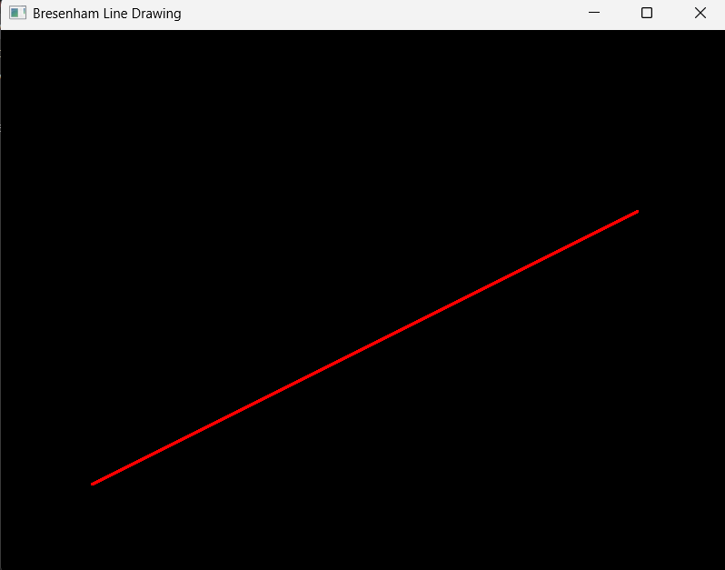
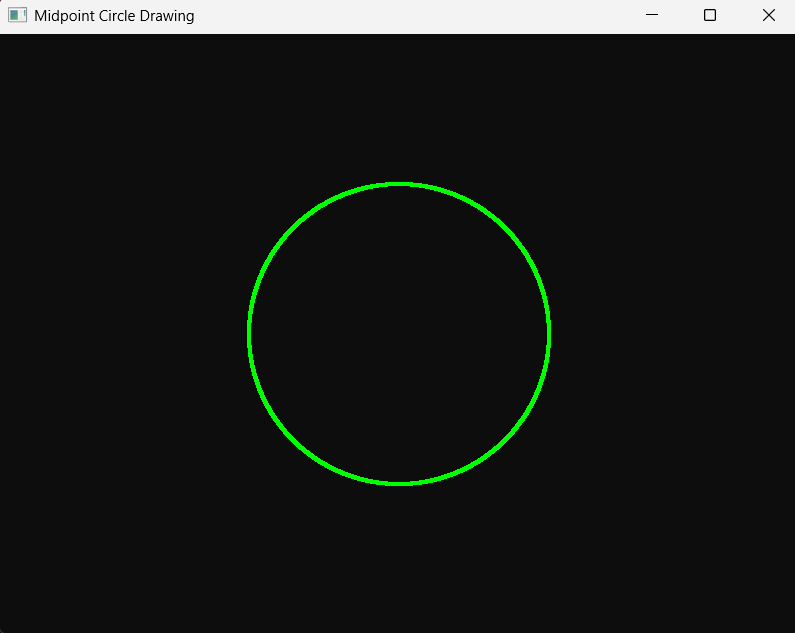

# Computer Graphics Lab

This repository contains implementations of computer graphics algorithms using **Python and PyOpenGL**.

## Lab Programs

### 1. Bresenham Line Drawing Algorithm

**Description:**
The Bresenham Line Drawing Algorithm is an incremental line rasterization algorithm that uses integer arithmetic to determine which pixels should be plotted to approximate a straight line.

**Implementation:**

[`Bresenham Line Drawing/main.py`](Bresenham%20Line%20Drawing/main.py)

**Output:**



---

### 2. Midpoint Circle Drawing Algorithm

**Description:**
The Midpoint Circle Drawing Algorithm uses a decision parameter to determine the closest pixels to the circumference of a circle. It calculates one octant of the circle and uses 8-way symmetry to generate the remaining points.

**Implementation:**

[`Midpoint Circle Drawing/main.py`](Midpoint%20Circle%20Drawing/main.py)

**Output:**



---

## Technologies Used

* Python
* PyOpenGL
* GLFW
* OpenGL


## How to Run

Install the required packages:

```bash
pip install PyOpenGL PyOpenGL_accelerate glfw
```

Then navigate to the required lab folder and run:

```bash
python main.py
```


