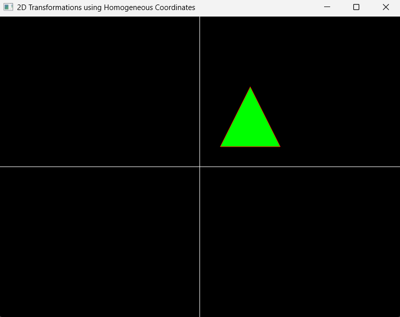
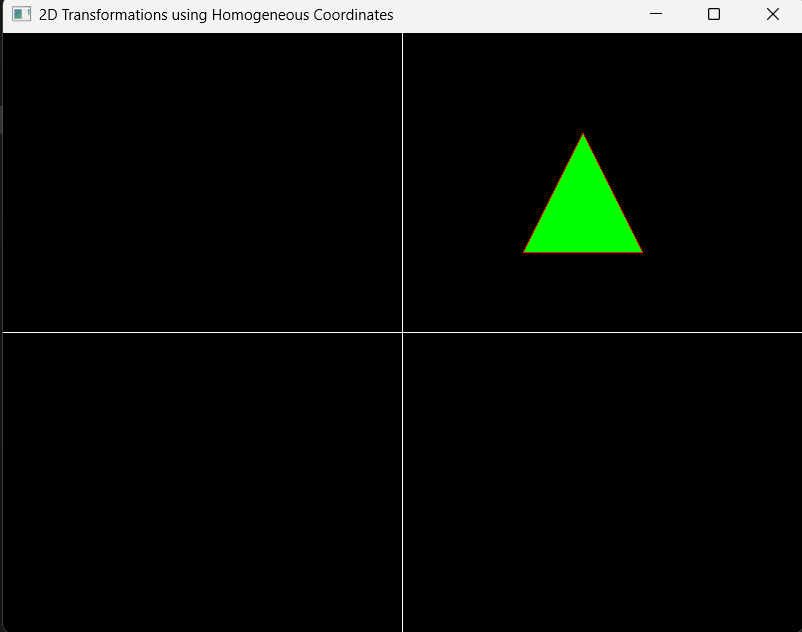
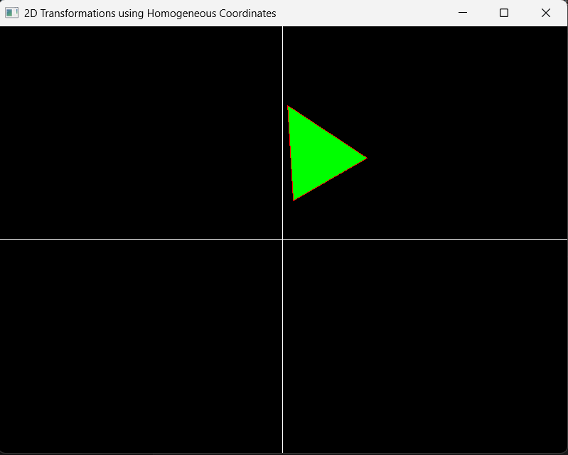
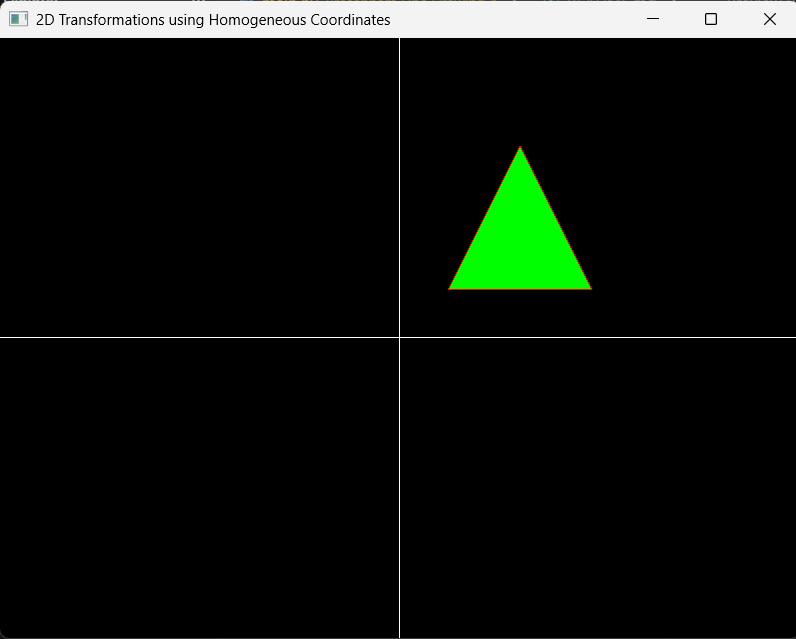
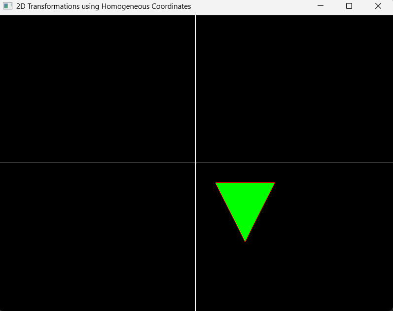
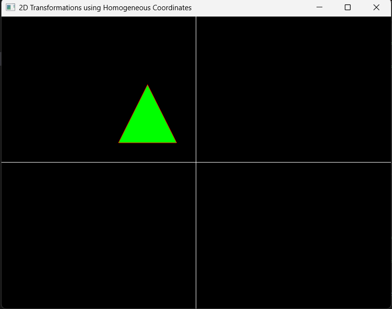
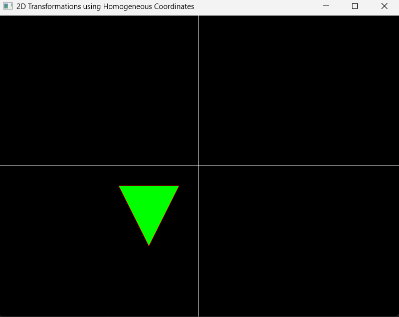

# Computer Graphics Lab

This repository contains implementations of computer graphics algorithms using **Python and PyOpenGL**.

## Lab Programs

### 1. Bresenham Line Drawing Algorithm

**Description:**
The Bresenham Line Drawing Algorithm is an incremental line rasterization algorithm that uses integer arithmetic to determine which pixels should be plotted to approximate a straight line.

**Implementation:**

[`Bresenham Line Drawing/main.py`](Bresenham%20Line%20Drawing/main.py)

**Output:**


---

### 2. Midpoint Circle Drawing Algorithm

**Description:**
The Midpoint Circle Drawing Algorithm uses a decision parameter to determine the closest pixels to the circumference of a circle. It calculates one octant of the circle and uses 8-way symmetry to generate the remaining points.

**Implementation:**

[`Midpoint Circle Drawing/main.py`](Midpoint%20Circle%20Drawing/main.py)

**Output:**


---

### 3. 2D Transformations Using Homogeneous Coordinates

**Description:**
This program demonstrates 2D geometric transformations on a triangle using homogeneous coordinate matrices. It supports translation, rotation, scaling, and reflection about the X-axis, Y-axis, and origin.

**Implementation:**

[`2d_Tarsformation/main.py`](2d_Tarsformation/main.py)

Use keys `1` through `6` to apply the available transformations:

1. Translation
2. Rotation
3. Scaling
4. Reflection about the X-axis
5. Reflection about the Y-axis
6. Reflection about the origin

**Outputs:**

| Transformation | Original | Transformed Output |
| :---: | :---: | :---: |
| Translation |  |  |
| Rotation |  |  |
| Scaling |  |  |
| Reflection about the X-axis |  |  |
| Reflection about the Y-axis |  |  |
| Reflection about the origin |  |  |

---

## Technologies Used

* Python
* PyOpenGL
* GLFW
* OpenGL


## How to Run

Install the required packages:

```bash
pip install PyOpenGL PyOpenGL_accelerate glfw
```

Then navigate to the required lab folder and run:

```bash
python main.py
```


